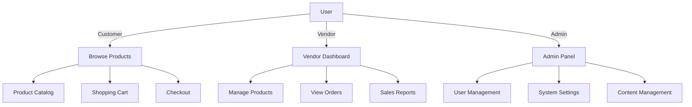
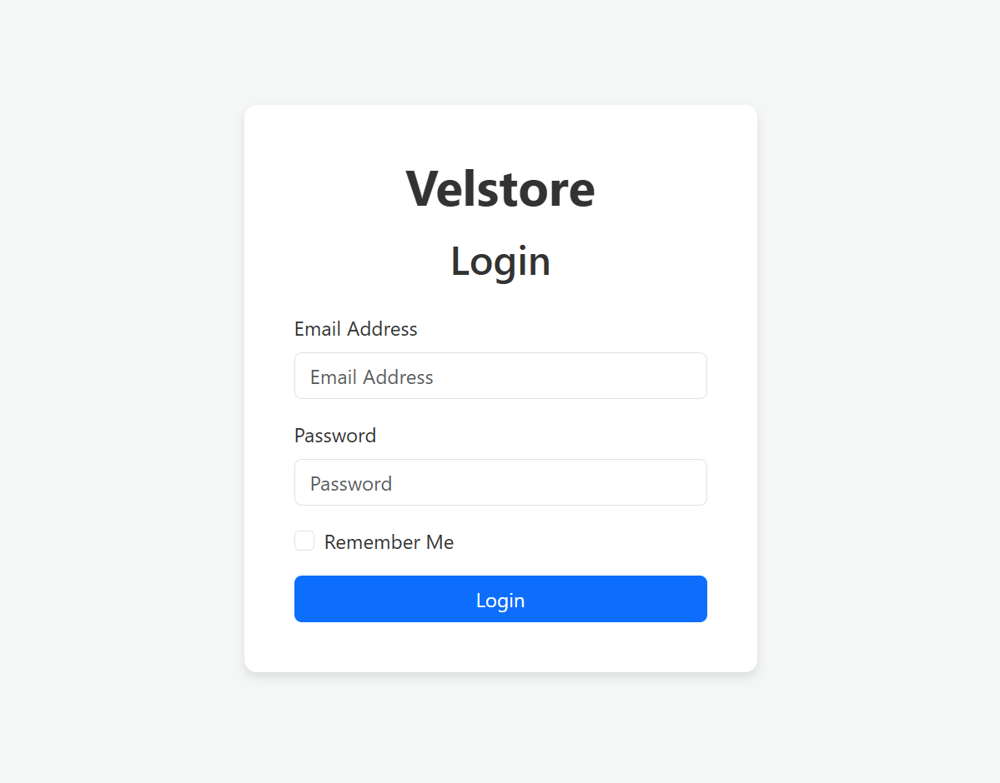
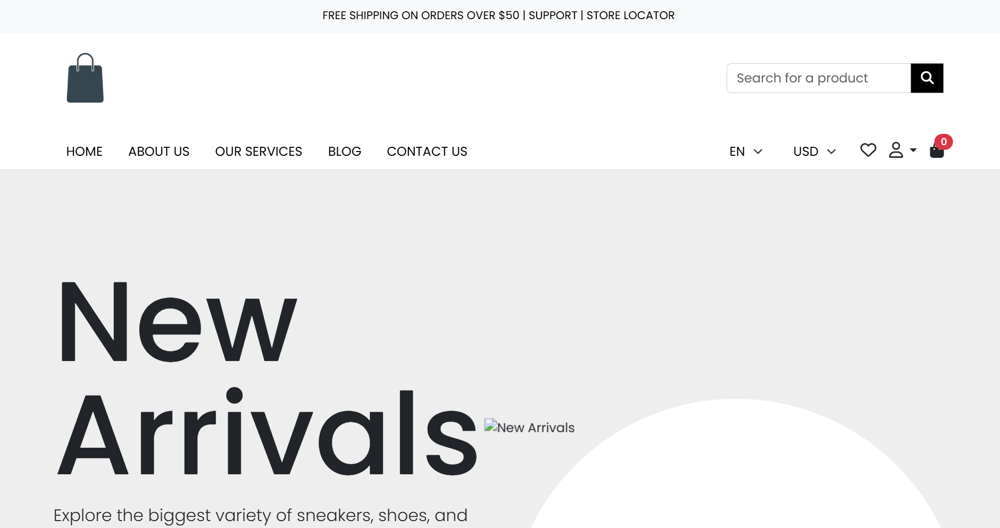
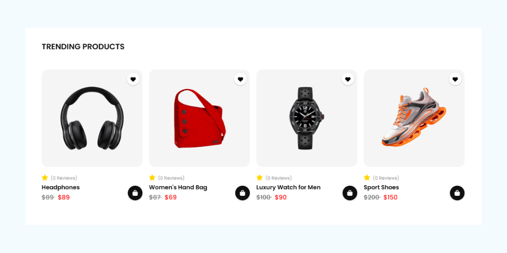
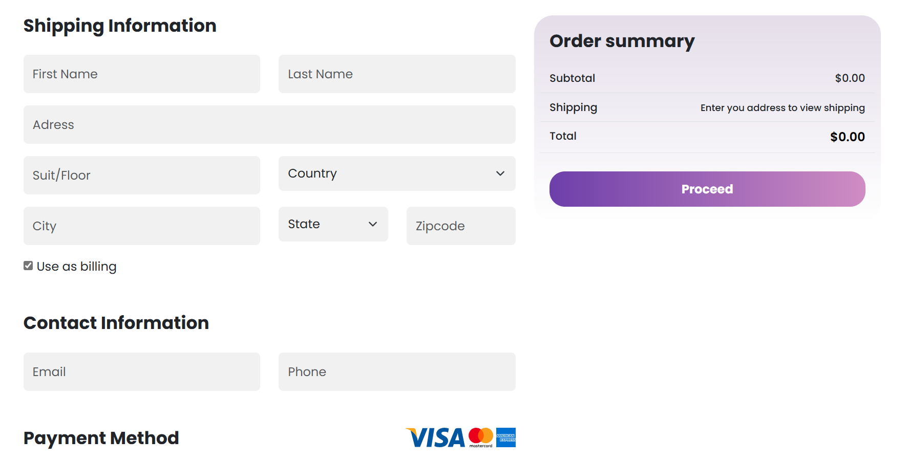
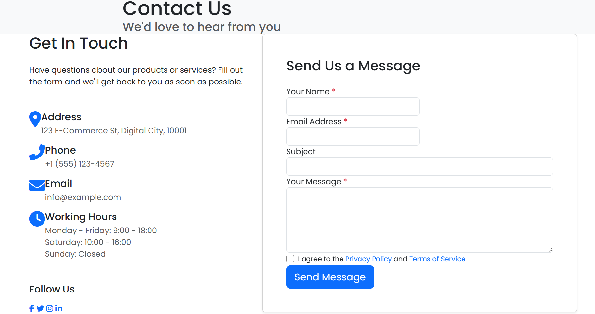
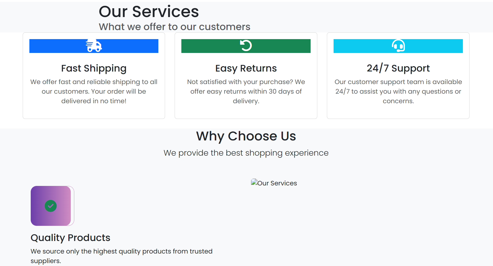

<p align="center">
  
</p>

<p align="center">
  <a href="https://packagist.org/packages/velstorelabs/velstore">
    
  </a>
  <a href="https://github.com/velstorelabs/velstore/releases">
    
  </a>
  <a href="https://github.com/velstorelabs/velstore/blob/master/LICENSE">
    
  </a>
</p>

<p align="center">
  
</p>

# VelStore - Multi-Vendor eCommerce Platform

VelStore is a powerful, open-source, and fully customizable multi-vendor eCommerce platform built with Laravel. It's designed to help you launch and manage your online marketplace with ease.

## Key Features

### For Customers
- Intuitive product browsing and search
- Advanced shopping cart
- Secure checkout process
- Mobile-responsive design
- Multi-language support
- Order tracking
- Product reviews and ratings

### For Vendors
- Personal store management
- Sales analytics and reports
- Product and inventory management
- Order management
- Payout system

### For Administrators
- User and vendor management
- Product and category management
- Comprehensive dashboard
- System configuration
- Role-based access control

## System Requirements

- PHP 8.1 or higher
- Composer
- MySQL 5.7+ or MariaDB 10.3+
- Node.js & NPM
- Web server (Apache/Nginx)

## Installation

### 1. Clone the repository
```bash
git clone https://github.com/velstorelabs/velstore.git
cd velstore
```

### 2. Install PHP dependencies
```bash
composer install
```

### 3. Install NPM dependencies
```bash
npm install
npm run dev
```

### 4. Configure Environment
```bash
cp .env.example .env
php artisan key:generate
```

### 5. Configure Database
Edit `.env` file with your database credentials:
```
DB_CONNECTION=mysql
DB_HOST=127.0.0.1
DB_PORT=3306
DB_DATABASE=velstore
DB_USERNAME=your_username
DB_PASSWORD=your_password
```

### 6. Run Migrations and Seeders
```bash
php artisan migrate --seed
```

### 7. Create Storage Link
```bash
php artisan storage:link
```

### 8. Start Development Server
```bash
php artisan serve
```

## System Architecture



## Directory Structure

```
velstore/
├── app/                 # Application core
├── config/              # Configuration files
├── database/            # Migrations and seeders
├── public/              # Publicly accessible files
├── resources/           # Views, assets, and language files
├── routes/              # Application routes
└── tests/               # Automated tests
```

## Configuration

Key configuration files:
- `.env` - Environment configuration
- `config/app.php` - Application settings
- `config/auth.php` - Authentication settings
- `config/filesystems.php` - File storage settings

## Testing

Run the test suite:
```bash
php artisan test
```

## Screenshots

### 1. Login

Allows users to securely access their accounts using email and password authentication.

### 2. Admin Dashboard

Displays featured products, categories, and promotional banners for quick browsing.

### 3. Product Management

Organizes store items into categories like phones, clothes, and accessories for easy display and navigation.

### 4. Order Processing

Handles cart checkout, payment confirmation, and order tracking from placement to delivery.

### 5. Contact Us

Lets users reach out via form submission for inquiries, feedback, or assistance.

### 6. Customer Service

Provides users with support options including FAQs, live chat, and help tickets.

Create a new database, then rename `.env.example` to `.env` and update the database credentials. Run the following command to install Velstore:
```sh
php artisan install:velstore --with-import
```

### **Options**
- `--with-import` Imports sample data to help you get started quickly.

Start the Laravel server:
```sh
php artisan serve
```

Your Velstore instance is now running! Open your browser and visit:
```sh
http://127.0.0.1:8000
```

## Tech Stack
- Backend: Laravel 10+
- Database: MySQLi
- Frontend: Blade (with Laravel UI)
- Authentication: Laravel Sanctum
- DataTables: Yajra Laravel Datatables